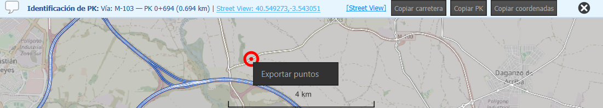
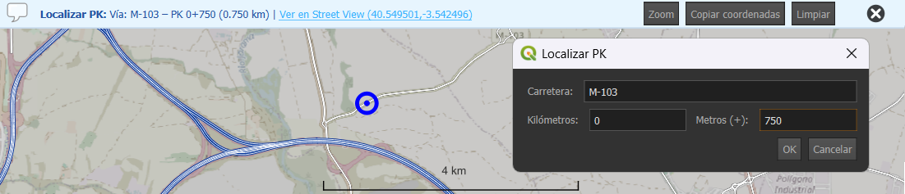
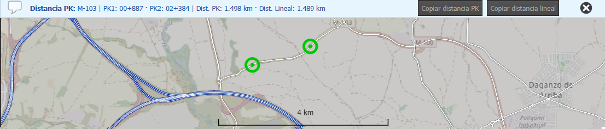
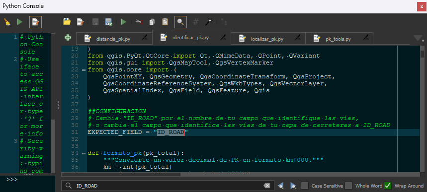
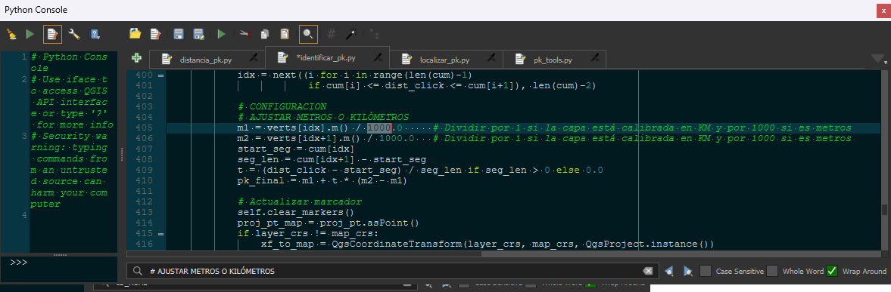

# PK Tools

**PK Tools** unifica tres herramientas en un único complemento de QGIS:


## 🔎 Identificar PK
Permite identificar la vía y el punto kilométrico haciendo clic sobre una capa de carreteras (líneas calibradas con valores M).  
Muestra el nombre de la vía, el PK interpolado, un enlace a Street View y botones para copiar información al portapapeles.  
Además, permite exportar los PKs identificados a una capa temporal de puntos mediante clic derecho en el mapa.  
El punto identificado queda marcado hasta que se seleccione otro o se apague el botón de la herramienta.


## 📍 Localizar PK
Abre una ventana donde el usuario puede introducir la carretera y el PK para ubicar el punto exacto en el mapa.  
El complemento muestra un marcador, un enlace a Street View y un botón para centrar el mapa en el punto seleccionado.  
Dispone de un historial accesible desde el menú desplegable del botón y permite exportar los puntos seleccionados a una capa temporal.  
El marcador permanece hasta que se localice otro punto o se borre manualmente desde el menú.


## 📏 Distancia PK
Permite medir la distancia entre dos PKs sobre la misma vía, mostrando tanto la diferencia en PKs (basada en la calibración M) como la distancia lineal real calculada sobre la geometría.  
Esto resulta muy útil porque pueden darse discrepancias entre la calibración y la geometría real.  
Los puntos medidos quedan señalados con marcadores hasta que se realiza una nueva medición o se apaga la herramienta.


---

Estas herramientas son ideales para proyectos de carreteras o análisis de movilidad, agilizando en gran medida el flujo de trabajo.

---

## 📥 Instalación

1. Descarga el repositorio de GitHub.  
2. Copia la carpeta `pk_tools` en la carpeta de complementos de tu perfil de QGIS. Por ejemplo:  
   - **Windows**: `C:\Users\USUARIO\AppData\Roaming\QGIS\QGIS3\profiles\default\python\plugins\pk_tools`  
   - **Linux/Mac**: `~/.local/share/QGIS/QGIS3/profiles/default/python/plugins/`  
3. Reinicia QGIS.  
4. Revisa los requisitos y, si no se cumplen, revisa la sección ⚙️ Configuración.  
5. Activa el complemento desde el menú **Complementos → Administrar e instalar complementos**.

---

## 📋 Requisitos

- QGIS 3.22+ (probado en QGIS 3.34).  
- Capas de carreteras lineales con valores M (calibración), como las distribuidas por la [DGT](https://www.transportes.gob.es/carreteras/catalogo-y-evolucion-de-la-red-de-carreteras/archivos-geometrias-rce).  
- El campo que contiene el identificador de la vía debe llamarse por defecto **`ID_ROAD`**.  
- La capa de líneas debe estar calibrada en **metros**.  

---

## ⚙️ Configuración

### Campo de la vía
Si tu capa usa un campo distinto a `ID_ROAD` para identificar las vías, tienes dos opciones:

1. **Renombrar el campo** en la capa a `ID_ROAD`:  
   - Clic derecho sobre la capa → Propiedades → Campos → Editar → cambia el nombre del campo.  

2. **Editar el código del complemento**:  
   - Abre los archivos `identificar_pk.py`, `localizar_pk.py` y `distancia_pk.py` en la carpeta:  
     ```
     QGIS\QGIS3\profiles\default\python\plugins\pk_tools\tools
     ```
   - Busca el texto `ID_ROAD` y sustitúyelo por el nombre de tu campo (respetando las comillas):
     Puedes hacerlo con el bloc de notas o con la consola de Python de QGIS:
     
     
   - Guarda los cambios y reinicia QGIS.  

### Unidades de calibración M
El complemento interpreta los valores M de la geometría como **metros**.

- Si tu capa está calibrada en **kilómetros**, los valores calculados serán 1000 veces más bajos de lo real.  
- Para corregirlo:  
  - Abre los archivos mencionados y localiza la marca `# AJUSTAR METROS O KILÓMETROS`.  
  - Modifica la conversión (división entre 1000 o no) según corresponda a la unidad de calibración de tu capa.
  - 
  
---

## ⚠️ Limitaciones y advertencias

- **Tipo de datos**:  
  - El complemento está pensado para capas lineales con geometría M.  
  - Si la capa no tiene valores M, las herramientas **Identificar PK** y **Localizar PK** no funcionarán.  
  - La herramienta **Distancia PK** puede calcular la distancia lineal en capas sin M, aunque en ese caso no calcula PKs.  
- **Rendimiento**: en capas muy grandes, la búsqueda de vecinos y la interpolación pueden ralentizarse.  
- **Edición de capas**: no se recomienda usar estas herramientas mientras la capa de líneas está en edición para evitar resultados inconsistentes.  
- **Street View**: requiere conexión a Internet y solo debe considerarse como una ayuda visual; respeta los términos de uso de Google.  

💡 Consejo: valida siempre que tu capa esté calibrada en **metros** y que el campo identificador de vía sea correcto antes de usar el complemento.

---

## 📄 Licencia

Este proyecto se distribuye bajo la **GNU General Public License v3.0 (GPL-3.0)**.  
Puedes usarlo, modificarlo y compartirlo libremente bajo los términos de esta licencia.  

---

## 👤 Autor

- **Nombre**: Javi H. Piris  
- **Email**: pirishj@gmail.com  
- **GitHub**: [@Javisionario](https://github.com/Javisionario)  
