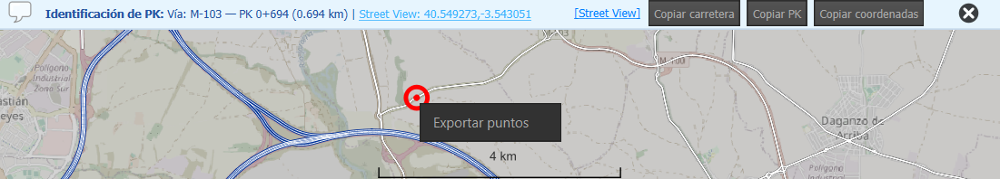
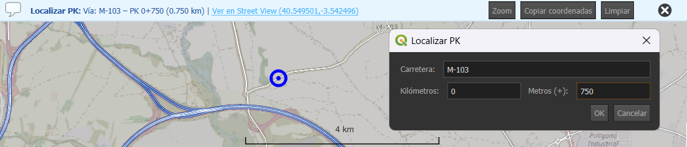
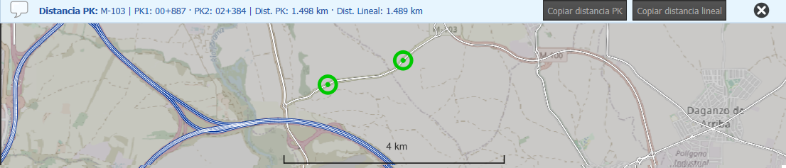

# PK Tools

**PK Tools** unifica tres herramientas en un único complemento de QGIS:

---

## 🔧 Qué hace PK Tools

PK Tools está pensado para trabajar con **capas lineales con geometría M**.
Puede usarse en un contexto de carreteras y puntos kilométricos, pero también en análisis genéricos donde la geometría almacena una medida M.

El complemento trabaja siempre sobre **una capa de trabajo configurable** y ofrece tres herramientas:

- **Identificar**: obtiene la medida M o PK en un punto clicado sobre la capa.
- **Localizar**: localiza una medida M o PK concreta sobre una vía/identificador.
- **Distancia**: mide entre dos posiciones sobre la misma geometría o parte inicial.

PK Tools **no genera ni corrige valores M**. Trabaja sobre geometrías que ya contienen valores M válidos.

---

## 🧭 Identificar

Permite identificar la vía/identificador y la posición medida haciendo clic sobre una línea calibrada con valores M.

- En modo **Formato PK**, muestra la vía y el PK, por ejemplo `PK 150+500`.
- En modo **Valor M bruto**, muestra el identificador y la medida, por ejemplo `M 150500`.
- Muestra coordenadas y enlace a Street View cuando es posible.
- Incluye botones para copiar el identificador, el resultado y las coordenadas.
- Mantiene un historial interno de puntos identificados.
- Permite exportar puntos identificados a una capa temporal.
- En geometrías multipart, usa la parte más cercana al clic para evitar unir partes distintas.

Exportación:

- Modo **Formato PK**: `VIA`, `PK`, `PK_NUM`.
- Modo **Valor M bruto**: `IDENTIFICADOR`, `M_RAW`.

---

## 📍 Localizar

Abre una ventana donde el usuario puede introducir:

- Una vía o identificador.
- Un PK o una medida M, según el modo de salida configurado.

El complemento:

- Usa autocompletado para el campo vía/identificador.
- El autocompletado es insensible a mayúsculas/minúsculas.
- Conserva los valores originales: `MA-10` y `Ma-10` se mantienen como valores distintos.
- No normaliza el valor real usado para localizar.
- Dibuja un marcador en el mapa.
- Muestra enlace a Street View, botón de zoom y copia de coordenadas.
- Mantiene un historial accesible desde el menú desplegable del botón.
- Permite exportar puntos seleccionados del historial a una capa temporal.

En modo **Formato PK**, la entrada acepta formatos como:

- `150`
- `150.500`
- `150,500`
- `150+500`
- `0+010`

En modo **Valor M bruto**, la entrada acepta la medida M directa, por ejemplo:

- `150500`

Si el valor buscado cae en un hueco interno sin cobertura, o queda fuera del rango disponible, PK Tools muestra un aviso breve y ofrece un botón **Ajustar** al valor disponible más próximo. No ajusta automáticamente sin acción del usuario.

Exportación:

- Modo **Formato PK**: `VIA`, `PK`, `PK_NUM`.
- Modo **Valor M bruto**: `IDENTIFICADOR`, `M_RAW`.

---

## 📏 Distancia

Permite medir entre dos posiciones sobre la misma geometría o parte seleccionada con el primer clic.

Muestra:

- La diferencia entre las medidas M o PK.
- La distancia lineal sobre la geometría.

Características importantes:

- Solo acepta clic izquierdo.
- El primer clic selecciona la feature y, si es multipart, la parte concreta más cercana.
- El segundo clic se proyecta sobre esa misma parte inicial.
- No hace routing.
- No reconstruye rutas.
- No une features partidas.
- No une partes multipart como si fueran continuas.
- Usa la tolerancia clic-vía para avisar si el segundo clic está lejos de la geometría inicial.
- Usa `QgsDistanceArea` cuando procede para medir la distancia lineal de forma adecuada al CRS.
- La lógica M se mantiene siempre sobre los valores M originales de la geometría.

Esto es útil porque puede haber diferencias entre la calibración M y la longitud geométrica real.

---

## Huecos de cobertura

PK Tools distingue entre el rango global de una vía/identificador y los intervalos reales de cobertura M.

Si una vía llega, por ejemplo, hasta `PK 285+000` y continúa desde `PK 290+500`, una búsqueda de `PK 290+000` se considera un hueco interno. En ese caso:

- El plugin informa de que el valor no tiene cobertura.
- Calcula el valor disponible más próximo.
- Ofrece un botón para ajustar manualmente.
- No inventa posiciones dentro de huecos grandes.
- No salta automáticamente sin acción del usuario.

---

## 📥 Instalación

### 1. Desde el repositorio oficial de QGIS (recomendado)

1. Abre QGIS.
2. Ve a `Complementos -> Administrar e instalar complementos`.
3. En la pestaña **Todos**, busca **PK Tools**.
4. Selecciónalo y pulsa **Instalar complemento**.
5. Actívalo desde la pestaña **Instalados** si no se activa automáticamente.

Al activarlo, aparecerá una barra de herramientas propia llamada `PK Tools`, con tres botones: Identificar, Localizar y Distancia. Al final de la barra hay un botón de opciones para abrir la configuración.

### 2. Desde GitHub (ZIP)

1. En GitHub, descarga el repositorio: `Code -> Download ZIP`.
2. En QGIS, ve a `Complementos -> Administrar e instalar complementos -> Instalar desde ZIP`.
3. Selecciona el ZIP descargado y pulsa **Instalar complemento**.
4. Actívalo en la pestaña **Instalados** si no se activa automáticamente.

### 3. Instalación manual

1. Descomprime y copia la carpeta del plugin en la carpeta de complementos de tu perfil de QGIS, por ejemplo:
   - **Windows**: `C:\Users\USUARIO\AppData\Roaming\QGIS\QGIS3\profiles\default\python\plugins\PK_tools`
   - **Linux/Mac**: `~/.local/share/QGIS/QGIS3/profiles/default/python/plugins/PK_tools`
2. Reinicia QGIS.
3. Activa el complemento en `Complementos -> Administrar e instalar complementos -> Instalados`.

---

## 📋 Requisitos

- QGIS 3.22 o superior, probado especialmente en QGIS 3.34 LTR.
- Una capa vectorial:
  - De tipo línea.
  - Con geometría M.
  - Con valores M válidos.
- Un campo identificador/vía en la tabla de atributos.

Los valores M pueden estar configurados como:

- **Metros**.
- **Kilómetros**.

Si la capa no es lineal o no contiene geometría M, las herramientas mostrarán un aviso y no continuarán.

---

## ⚙️ Configuración

La configuración se abre desde el botón de opciones de la barra `PK Tools`.
También se solicitará al usar una herramienta si no existe una configuración válida.

La configuración se guarda entre sesiones. Si ya hay una configuración válida, PK Tools no abre la ventana automáticamente al cargar el complemento.

En la ventana se configuran estos ajustes:

1. **Capa lineal con geometría M**
   Capa sobre la que trabajarán las herramientas.

2. **Campo identificador / vía**
   Campo usado para identificar carreteras, tramos, ejes u otros elementos lineales.

3. **Unidades de la medida M**
   Indica si los valores M de la geometría están en metros o kilómetros.

4. **Salida mostrada**
   - **Formato PK**: muestra resultados como `PK 150+500`.
   - **Valor M bruto**: muestra resultados como `M 150500`.

5. **Tolerancia clic-vía**
   Umbral visual, en píxeles, usado por Distancia para avisar cuando el segundo clic cae lejos de la geometría inicial.

La vista previa muestra ejemplos de valores M originales y cómo se verían con la configuración seleccionada.

---

## Modo Formato PK

Modo orientado a carreteras y puntos kilométricos.

Vocabulario usado:

- **Vía**
- **PK**

Ejemplos de entrada aceptados en Localizar:

- `150`
- `150.500`
- `150,500`
- `150+500`
- `0+010`

Ejemplo de salida:

- `PK 150+500`

Exportación:

- `VIA`
- `PK` con valor de texto, por ejemplo `150+500`.
- `PK_NUM` con valor numérico en kilómetros, por ejemplo `150.500`.

---

## Modo Valor M bruto

Modo genérico para capas lineales con geometría M que no representan necesariamente carreteras o PKs.

Vocabulario usado:

- **Identificador**
- **Medida**

Ejemplo de entrada en Localizar:

- `150500`

Ejemplo de salida:

- `M 150500`

Exportación:

- `IDENTIFICADOR`
- `M_RAW`

En este modo se evita hablar de PK en la interfaz, banners, historial y exportaciones.

---

## ✅ Uso rápido

1. Abre la configuración desde el botón de opciones.
2. Selecciona la capa lineal con geometría M.
3. Selecciona el campo identificador/vía.
4. Indica si los valores M están en metros o kilómetros.
5. Elige la salida mostrada: Formato PK o Valor M bruto.
6. Usa:
   - **Identificar** para obtener la medida en un clic.
   - **Localizar** para ir a una medida concreta.
   - **Distancia** para medir entre dos posiciones sobre la misma geometría o parte inicial.

---

## ⚠️ Limitaciones y advertencias

- PK Tools depende de que la geometría tenga valores M válidos.
- El plugin no genera ni corrige geometrías M.
- La calidad del resultado depende de la calidad y coherencia de la geometría M.
- Distancia no es una herramienta de rutas.
- Distancia no busca caminos alternativos, no une features partidas y no reconstruye recorridos.
- Si existen varias geometrías candidatas con el mismo identificador y rangos M similares, el plugin aplica una lógica conservadora.
- En capas muy grandes, algunas operaciones pueden tardar más, especialmente al cargar autocompletados o recorrer geometrías complejas.
- Street View requiere conexión a Internet y depende de la disponibilidad del servicio.

---

## Licencia

Este proyecto se distribuye bajo la **GNU General Public License v3.0 (GPL-3.0)**.  
Puedes usarlo, modificarlo y compartirlo libremente bajo los términos de esta licencia.

---

## Autor

- **LinkedIn**: [Javi H. Piris](https://www.linkedin.com/in/javierhpiris)
- **GitHub**: [@Javisionario](https://github.com/Javisionario)
